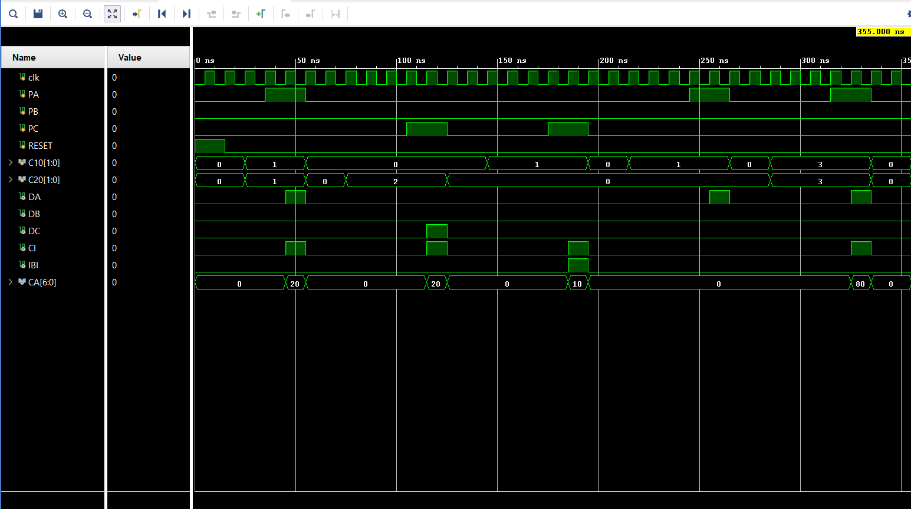

# Vending Machine Controller (FSM Based)

## Project Overview
This project implements a digital Vending Machine Controller using a Finite State Machine (FSM) in Verilog. It handles coin insertion, product selection, change calculation, and product dispensing. The project includes both the Verilog HDL implementation (with a testbench for simulation) and a Proteus hardware logic implementation.

## Features
*   **Accepts Multiple Coins:** Accepts ₹10 and ₹20 coins. Multiple coins can be inserted before making a selection.
*   **Multiple Products:** Offers three distinct products: 
    *   Product A (PA): ₹10
    *   Product B (PB): ₹15
    *   Product C (PC): ₹20
*   **Exact Change Calculation:** Calculates and returns the exact change if the inserted amount exceeds the product price.
*   **Insufficient Balance Handling:** If the user selects a product that costs more than the inserted amount, the machine will not dispense the product, turns on an Insufficient Balance Indicator (IBI), and returns the inserted money.

## Finite State Machine (FSM) Architecture
The controller is built on a 3-state FSM model:

| State | Encoding | Description |
| :--- | :--- | :--- |
| **S0** | `00` | **Idle State:** The machine waits for a coin insertion. If a coin (₹10 or ₹20) is inserted, it transitions to S1. |
| **S1** | `01` | **Product Selection State:** The machine accepts more coins if needed and waits for the user to select Product A, B, or C. Upon selection, it moves to S2. |
| **S2** | `10` | **Output Generation State:** Compares the inserted value with the product cost. Dispenses the product (DA, DB, DC) and calculates change (CA, CI) if funds are sufficient. Triggers the IBI and returns funds if insufficient. Transitions back to S0. |

### State Transition Logic

## Input and Output Signals

### Inputs
*   `clk`: System Clock.
*   `reset`: Active high reset signal. Returns FSM to S0 from any state.
*   `C10 [1:0]`: ₹10 coin insertion signal.
*   `C20 [1:0]`: ₹20 coin insertion signal.
*   `PA`, `PB`, `PC`: Product selection buttons.

### Outputs
*   `DA`, `DB`, `DC`: Dispense signals for Products A, B, and C.
*   `IBI`: Insufficient Balance Indicator.
*   `CI`: Change Indicator (High if change is being returned).
*   `CA [6:0]`: Change Amount to be dispensed.

## Proteus Hardware Implementation Notes
To optimize the hardware design and combinational logic in Proteus, the numerical values of coins and product costs are scaled down (divided by 5). 
*   **State Memory:** Uses 2 D-Flip-Flops to store the state bits.
*   **Adders & Comparators:** An adder calculates the total inserted value, which is then compared against the selected product's value. 
*   **7-Segment Display Logic:** When displaying the change (`CA`), the logic checks the Least Significant Bit (LSB). 
    *   If `CA[0]` is `1`, the ones digit on the display is `5`. 
    *   If `CA[0]` is `0`, the ones digit is `0`.
    *   The remaining bits (`CA[4:1]`) represent the tens digit (equivalent to `10x`).

### Input Logic Schematic

### Output Logic Schematic

## Repository Contents
*   `vending.v`: The main Verilog module containing the FSM and controller logic.
*   `vending_test.v`: The Verilog testbench used to simulate and verify the controller.
*   `sim_waveforms.png`: Simulation waveforms demonstrating the FSM behavior.
*   `Proteus_simulation.pdsprj`: The complete hardware logic implementation designed in Proteus.

## How to Run the Verilog Simulation
1.  Open your preferred Verilog simulator (e.g., ModelSim, Vivado, EDA Playground).
2.  Compile both `vending.v` and `vending_test.v`.
3.  Run the simulation. The testbench is self-checking and will monitor the console output for variable state changes over time.

## How to Run the Proteus Simulation
1. Ensure you have **Proteus Design Suite** installed.
2. Clone or download this repository to your local machine.
3. Open the `Proteus_simulation.pdsprj` file included in the repository using Proteus.
4. Click the **Play/Run** button at the bottom left of the Proteus workspace to start the simulation.
5. Interact with the circuit using the logic toggles/buttons for coin insertion (`C10`, `C20`) and product selection (`PA`, `PB`, `PC`).

## Simulation Waveforms

